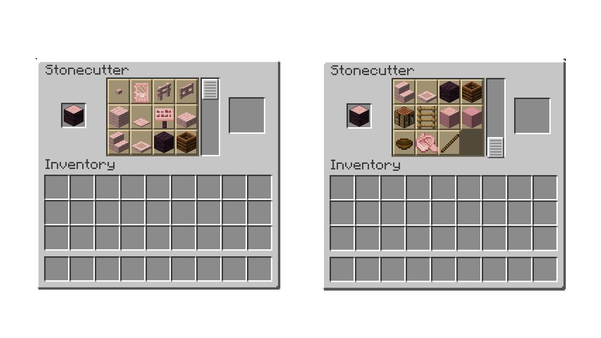
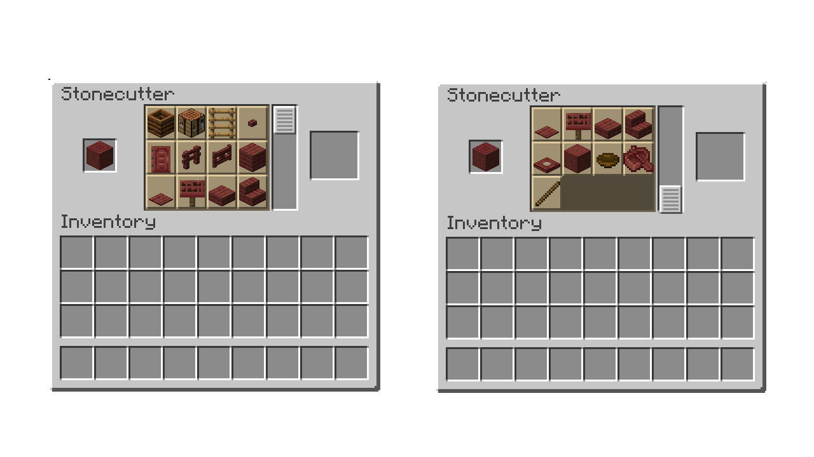
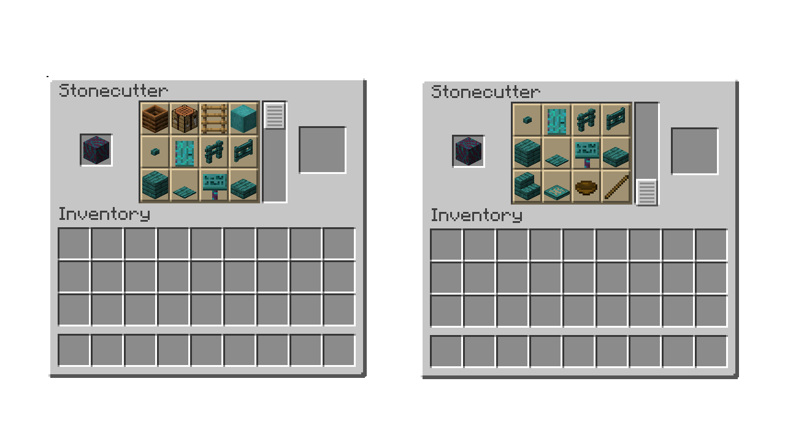
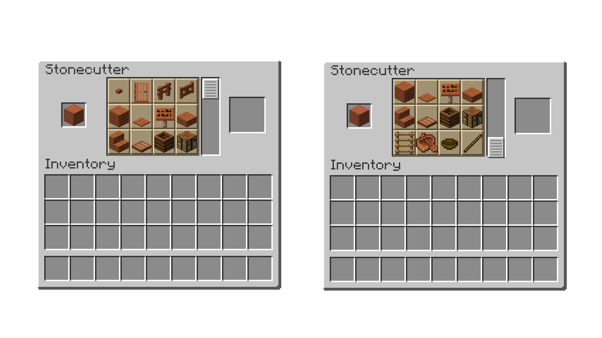
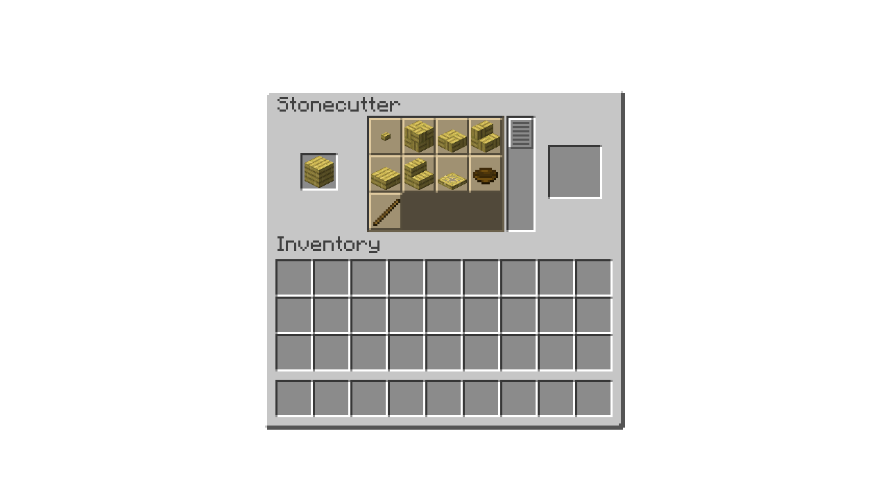

<h1 id="topBanner"align="center">
    
</h1>

    
[GitHub Release][release]&nbsp;&nbsp;&nbsp;|&nbsp;&nbsp;&nbsp;[Screenshots](#screenshots)&nbsp;&nbsp;&nbsp;|&nbsp;&nbsp;&nbsp;[Issues][issues]

<h1>Woodcutter</h1>
Datapack for Minecraft 1.21! This datapack adds over 700 new balanced recipes to stonecutter to use it for wood. All types of logs, woods, stripped logs, stripped woods, and planks can be used in the <del>stone</del>woodcutter.

<h2 id="screenshots">Screenshots</h2>

<h3>Exemple recipes</h3>

[release]:https://github.com/ChillCraftDevelopment/Woodcutter/releases/latest "Latest Release (external link)"
[issues]:https://github.com/ChillCraftDevelopment/Woodcutter/issues "Issues (external link)"
